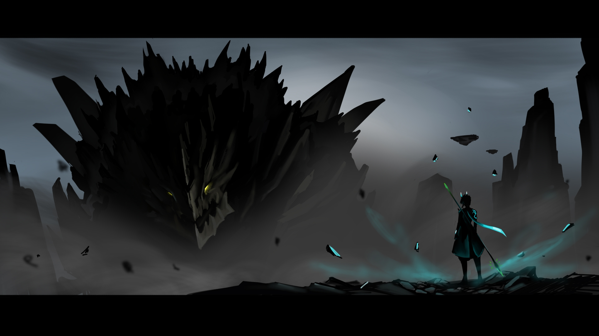

# 👋 Hello, I'm YYLMMZXC 😇

## 🎮 关于我
- **游戏爱好者**：热衷于《原神》和《崩坏：星穹铁道》
- **B站创作者**：分享游戏和编程相关内容
- **编程学习者**：正在探索各种编程语言和技术

## 🚀 我正在做什么
- 📖 探索游戏开发技术和项目
- 🌱 深入学习C#、Java、Python和Web开发
- 🎯 提升我的编程技能和项目管理能力

## 💻 技术栈

### 编程语言

  

    🔷
    C#
  

  

    ☕
    Java
  

  

    🐍
    Python
  

  

    🔤
    HTML
  

  

    🎨
    CSS
  

### 开发工具

  

    🖥️
    Visual Studio / VS Code
  

  

    💡
    IntelliJ IDEA
  

  

    📦
    Git & GitHub
  

## 📊 GitHub 统计
<!-- GitHub Stats Card -->

  
  
  

## 📫 联系我

  <a href="https://www.youtube.com/channel/UC9sSvoOdEGqmz4l1u4_YXVA" target="blank" style="display: flex; align-items: center; gap: 5px;">
    
    YouTube
  </a>
  <a href="https://space.bilibili.com/392592375" target="blank" style="display: flex; align-items: center; gap: 5px;">
    
    Bilibili
  </a>
  <a href="mailto:YYLMZXC@163.com" style="display: flex; align-items: center; gap: 5px;">
    
    163邮箱
  </a>
  <a href="https://gitee.com/yylmzxc" target="blank" style="display: flex; align-items: center; gap: 5px;">
    
    Gitee
  </a>

  <a href="https://v.douyin.com/YKRh4dM-A-4/" target="blank" style="display: flex; align-items: center; gap: 5px;">
    
    抖音
  </a>

## 🌐 我的网站
- [博客](https://www.cnblogs.com/yylmzxc/) - 分享我的学习和项目经验
- [GitHub Pages](https://yylmzxc.github.io/) - GitHub Pages
- [GitHub 仓库](https://github.com/YYLMZXC/yylmzxc.github.io) - yylmzxc Pages

## 🔗 相关链接
- [GitHub DMCA信息](https://github.com/github/dmca/blob/master/2024/02/2024-02-26-geshin-impact.md)
- [我的项目](https://github.com/YYLMZXC/hk4e)

## 🔗 主要开发项目
- [SurvivalcraftIOS](https://gitee.com/survivalcraft-net/survivalcraft-ios) - 
- [Survivalcraft_Server_DLL](https://gitee.com/sc-survivalcraft-gps/Survivalcraft_Server_DLL) - 

## 🎨 个人形象

  

    
  

  

    
探索游戏与编程的奇妙世界 🌟

  

---

  <i>"代码是艺术，游戏是生活"</i> 👾

